# HaiIntel Platform Infrastructure

**Production-ready shared infrastructure for HaiIntel platform** providing identity management, monitoring, and foundational services for all HaiIntel applications.

---

## 📋 Table of Contents

- [🎯 What This Infrastructure Provides](#-what-this-infrastructure-provides)
- [🏗️ Architecture Overview](#️-architecture-overview)
- [📦 Prerequisites](#-prerequisites)
- [🚀 Local Development](#-local-development)
  - [Testing Keycloak Integration](#testing-keycloak-integration)
  - [OAuth 2.0 & OAuth 2.1 Implementation](#oauth-20--oauth-21-implementation)
- [☁️ Azure Deployment](#️-azure-deployment)
- [📊 Monitoring & Observability](#-monitoring--observability)
- [🔧 Troubleshooting](#-troubleshooting)
- [🔗 Service URLs & Credentials](#-service-urls--credentials)
- [🤝 Contributing](#-contributing)
- [📄 License](#-license)

---

## 🎯 What This Infrastructure Provides

### Core Services

**Identity & Access Management (Keycloak)**

- Multi-tenant authentication and authorization
- OAuth 2.0 / OpenID Connect support
- Social login integration (GitHub, Google)
- User federation and identity brokering
- Role-based access control (RBAC)
- Pre-configured `haiintel` realm with roles and groups

**Database (PostgreSQL 15)**

- Dedicated PostgreSQL instance for Keycloak
- Persistent storage with automated backups
- Performance monitoring via PostgreSQL Exporter
- Connection pooling and optimization

**Monitoring Stack (Prometheus + Grafana)**

- Centralized metrics collection for all HaiIntel applications
- Real-time dashboards for Keycloak, PostgreSQL, and infrastructure
- Pre-configured alerts for critical issues
- Custom metrics and business KPIs

**Cloud Infrastructure (Azure AKS)**

- Managed Kubernetes cluster with auto-scaling
- Virtual Network with secure subnets
- Network Security Groups (NSGs) for traffic control
- Azure Load Balancer for external access
- Log Analytics for container insights
- Cost-optimized for startup environments (~$85/month dev)

### Why This Infrastructure Exists

This shared platform infrastructure serves as the **foundational layer** for all HaiIntel applications, providing:

1. **Centralized Identity Management** - Single source of truth for user authentication across all services
2. **Unified Monitoring** - One place to monitor all applications, databases, and infrastructure
3. **Cost Efficiency** - Shared services reduce duplication and infrastructure costs
4. **Scalability** - Built to scale from startup to enterprise
5. **Security** - Production-grade security with RBAC, network isolation, and secrets management
6. **Developer Productivity** - Quick local setup with Docker Compose, automated deployments

---

## 🏗️ Architecture Overview

### Directory Structure

```
infrastructure/
├── shared-infra/              # Platform-wide monitoring (Prometheus + Grafana)
│   ├── docker-compose.yml     # Shared monitoring stack
│   ├── prometheus/            # Metrics collection config
│   ├── grafana/               # Dashboards and datasources
│   └── Makefile               # Management commands
│
├── keycloak-infra/            # Identity & Access Management
│   ├── docker-compose.yml     # Keycloak + PostgreSQL + Exporter
│   ├── config/realms/         # Pre-configured realms
│   ├── terraform/             # Azure infrastructure as code
│   │   ├── bootstrap/         # State storage setup
│   │   ├── modules/           # Reusable modules (networking, AKS, monitoring)
│   │   └── environments/      # Dev, staging, prod configs
│   ├── kubernetes/manifests/  # K8s resources
│   ├── scripts/               # Automation scripts
│   └── docs/                  # Detailed documentation
│
└── scripts/                   # Shared utility scripts
```

### Component Architecture

```
┌─────────────────────────────────────────────────────────────┐
│              HaiIntel Platform Infrastructure                │
├─────────────────────────────────────────────────────────────┤
│                                                              │
│  ┌────────────────────────────────────────────────────┐    │
│  │         Shared Monitoring (Platform-wide)          │    │
│  ├────────────────────────────────────────────────────┤    │
│  │  • Prometheus (scrapes all services)               │    │
│  │  • Grafana (dashboards for all apps)               │    │
│  └────────────────────────────────────────────────────┘    │
│                          ▲                                   │
│                          │ (metrics)                         │
│         ┌────────────────┼────────────────┐                │
│         │                                  │                │
│  ┌──────▼──────────────────────────────────▼──────────┐   │
│  │  Keycloak Infrastructure                           │   │
│  ├────────────────────────────────────────────────────┤   │
│  │  • Keycloak 23.0 (IAM)                             │   │
│  │  • PostgreSQL 15 (Database)                        │   │
│  │  • PostgreSQL Exporter (DB Metrics)                │   │
│  │  • Terraform (Azure IaC)                           │   │
│  │  • Kubernetes Manifests                            │   │
│  └────────────────────────────────────────────────────┘   │
└─────────────────────────────────────────────────────────────┘
```

---

## 📦 Prerequisites

### For Local Development

- **Docker Desktop** (v20.10+) - [Install](https://www.docker.com/products/docker-desktop)
- **Docker Compose** (included with Docker Desktop)
- **Make** (optional, for convenience commands)
- **At least 4GB RAM** available for Docker
- **Ports available**: 8080, 3000, 5432, 9090, 9187

### For Azure Deployment

- **Azure Account** with active subscription
- **Azure CLI** (v2.50+) - [Install](https://docs.microsoft.com/en-us/cli/azure/install-azure-cli)
- **Terraform** (v1.5+) - [Install](https://www.terraform.io/downloads)
- **kubectl** (v1.28+) - [Install](https://kubernetes.io/docs/tasks/tools/)
- **kubelogin** - [Install](https://github.com/Azure/kubelogin)
- **Owner or Contributor** role in Azure subscription

---

## 🚀 Local Development

### Quick Start (2 minutes)

**Option 1: One-Command Start (Recommended)**

```bash
# Start everything with one command
./start-all.sh
```

This script will:

1. ✅ Check if Docker is running
2. ✅ Create the shared network (if needed)
3. ✅ Start shared infrastructure (Prometheus + Grafana)
4. ✅ Start Keycloak infrastructure (Keycloak + PostgreSQL + Exporter)
5. ✅ Wait for services to be healthy
6. ✅ Display service URLs and useful commands

**To stop everything:**

```bash
./stop-all.sh
```

**Option 2: Manual Start (Step-by-Step)**

```bash
# Step 1: Create Docker network (one-time setup)
docker network create haiintel-network

# Step 2: Start shared monitoring
cd shared-infra
make start

# Step 3: Start Keycloak infrastructure
cd keycloak-infra
make start

# Step 4: Verify everything is running
docker ps --filter "name=haiintel-"
```

### Local Development Commands

**Shared Infrastructure**

```bash
cd shared-infra

make start          # Start Prometheus + Grafana
make stop           # Stop services
make restart        # Restart services
make logs           # View logs
make status         # Check container status
make health         # Run health checks
make clean          # Remove containers and volumes
```

**Keycloak Infrastructure**

```bash
cd keycloak-infra

make start          # Start Keycloak stack
make stop           # Stop services
make restart        # Restart services
make logs           # View all logs
make logs-keycloak  # View Keycloak logs only
make logs-postgres  # View PostgreSQL logs only
make status         # Check container status
make health         # Run health checks
make clean          # Remove containers and volumes
```

### Accessing Services Locally

| Service        | URL                           | Credentials                  | Purpose                     |
| -------------- | ----------------------------- | ---------------------------- | --------------------------- |
| Keycloak Admin | http://localhost:8080/admin   | admin / admin                | Identity management console |
| Keycloak API   | http://localhost:8080         | -                            | OAuth/OIDC endpoints        |
| Grafana        | http://localhost:3000         | admin / admin                | Monitoring dashboards       |
| Prometheus     | http://localhost:9090         | -                            | Metrics and alerts          |
| PostgreSQL     | localhost:5432                | keycloak / keycloak_password | Database                    |
| PG Exporter    | http://localhost:9187/metrics | -                            | Database metrics            |

### Configuring Keycloak Locally

The `haiintel` realm is pre-configured with:

**Roles:**

- `user` - Standard user role
- `admin` - Administrator role
- `developer` - Developer role

**Groups:**

- `Users` - Standard users
- `Administrators` - Admin users
- `Developers` - Developer users

**Client:**

- `haiintel-web` - Web application client
- Redirect URIs: `http://localhost:3000/*`, `http://localhost:8000/*`
- Web Origins: `http://localhost:3000`, `http://localhost:8000`

**To customize:**

```bash
# Edit realm configuration
vim keycloak-infra/config/realms/haiintel-realm.json

# Restart Keycloak to apply changes
cd keycloak-infra
make restart
```

### Testing Keycloak Integration

A complete test application is provided in `test-app/` to verify Keycloak OIDC integration works correctly.

**Quick Start:**

```bash
# Navigate to test app
cd test-app

# Install dependencies (first time only)
npm install

# Start the test application
npm start
```

The test app will be available at **http://localhost:8000**

**What the Test App Demonstrates:**

1. ✅ **OAuth 2.0 Authorization Code Flow** with PKCE (OAuth 2.1 compliant)
2. ✅ **OpenID Connect (OIDC)** authentication layer
3. ✅ **User Authentication** via Keycloak
4. ✅ **Token Exchange** (authorization code for access token)
5. ✅ **User Info Retrieval** from ID token claims
6. ✅ **Logout Flow** with redirect back to app
7. ✅ **Session Management** with server-side storage

### OAuth 2.0 & OAuth 2.1 Implementation

This infrastructure implements **OAuth 2.0 Authorization Code Flow with PKCE**, which is fully compliant with **OAuth 2.1** security best practices.

#### What is OAuth 2.1?

OAuth 2.1 is the modernized version of OAuth 2.0 that consolidates security best practices and removes deprecated features:

- **Not a new protocol** - It's OAuth 2.0 with mandatory security enhancements
- **Removes insecure flows** - Deprecates Implicit Flow and Password Grant
- **Mandates PKCE** - Required for all clients (public and confidential)
- **Strengthens security** - Exact redirect URI matching, no tokens in URLs
- **Simplifies implementation** - Fewer options = less room for mistakes

#### OAuth 2.0 vs OAuth 2.1 Comparison

| Feature                                | OAuth 2.0   | OAuth 2.1          | This Implementation         |
| -------------------------------------- | ----------- | ------------------ | --------------------------- |
| **PKCE (Proof Key for Code Exchange)** | Optional    | ✅ **Mandatory**   | ✅ Implemented              |
| **Authorization Code Flow**            | Recommended | ✅ **Required**    | ✅ Implemented              |
| **Implicit Flow**                      | Allowed     | ❌ **Deprecated**  | ✅ Not used                 |
| **Password Grant (ROPC)**              | Allowed     | ❌ **Deprecated**  | ✅ Not used                 |
| **Exact Redirect URI Matching**        | Recommended | ✅ **Required**    | ✅ Implemented              |
| **Bearer Token in URL**                | Allowed     | ❌ **Forbidden**   | ✅ Not used                 |
| **Refresh Token Rotation**             | Optional    | ✅ **Recommended** | ✅ Supported by Keycloak    |
| **Short-lived Access Tokens**          | Optional    | ✅ **Recommended** | ✅ 5 minutes (configurable) |

**Key Takeaway:** This implementation follows OAuth 2.1 best practices, making it secure by default.

#### The OAuth 2.0 Dance - Sequence Diagram

The following diagram shows the complete OAuth 2.0 Authorization Code Flow with PKCE, including Google OIDC integration, token refresh, and logout:

```mermaid
sequenceDiagram
    actor User
    participant Browser
    participant WebApp as HAI Intel Web App
    participant Keycloak as Keycloak Auth Server
    participant Google as Google OIDC (Optional)

    Note over User,Google: OAuth 2.0 Authorization Code Flow with PKCE

    User->>Browser: 1. Click "Login"
    Browser->>WebApp: GET /login

    Note over WebApp: Generate PKCE values:<br/>code_verifier = random()<br/>code_challenge = SHA256(verifier)

    WebApp->>Browser: 2. Redirect to Keycloak
    Note right of WebApp: Parameters:<br/>- client_id<br/>- redirect_uri<br/>- code_challenge<br/>- scope<br/>- state (CSRF)

    Browser->>Keycloak: GET /auth?client_id=...&code_challenge=...

    Keycloak->>Browser: Show login page
    Note over Keycloak: Login Options:<br/>- Email/Password<br/>- Google OIDC<br/>- SCM Federation

    User->>Browser: 3. Select "Sign in with Google"
    Browser->>Keycloak: User choice: Google

    Keycloak->>Google: Redirect to Google OAuth
    Google->>User: Google login page
    User->>Google: Enter credentials
    Google->>Google: Validate credentials

    Google->>Keycloak: 4. Redirect with Google token
    Keycloak->>Keycloak: Exchange Google token<br/>Create user session<br/>Generate authorization code

    Keycloak->>Browser: 5. Redirect to callback
    Note right of Keycloak: GET /callback?<br/>code=ABC123&<br/>state=xyz

    Browser->>WebApp: GET /callback?code=ABC123&state=xyz

    Note over WebApp: Verify state parameter<br/>(CSRF protection)

    WebApp->>Keycloak: 6. POST /token<br/>Exchange code for tokens
    Note right of WebApp: Body:<br/>- grant_type=authorization_code<br/>- code=ABC123<br/>- code_verifier (PKCE proof)<br/>- client_id + client_secret<br/>- redirect_uri

    Note over Keycloak: Validate:<br/>- Code not expired<br/>- Code not reused<br/>- PKCE matches<br/>- Client credentials valid

    Keycloak->>WebApp: 7. Return tokens (JSON)
    Note right of Keycloak: {<br/>"access_token": "eyJhbG...",<br/>"refresh_token": "eyJhbG...",<br/>"id_token": "eyJhbG...",<br/>"token_type": "Bearer",<br/>"expires_in": 300<br/>}

    WebApp->>Browser: Store tokens securely
    Note over Browser: sessionStorage or memory<br/>Never localStorage!

    Browser->>User: Redirect to dashboard

    Note over User,Google: User is now authenticated ✅

    rect rgba(59, 130, 246, 0.15)
        Note over User,Google: Using Access Token (Authorized Requests)

        User->>Browser: 8. Query documents
        Browser->>WebApp: POST /api/query
        Note right of Browser: Authorization:<br/>Bearer eyJhbG...

        WebApp->>WebApp: Validate JWT:<br/>- Signature valid?<br/>- Not expired?<br/>- Issued by Keycloak?

        WebApp->>WebApp: Apply Intelligence Governance:<br/>- Tenant filter<br/>- Classification policy<br/>- Lifecycle status

        WebApp->>Browser: Return authorized results
        Browser->>User: Display results
    end

    rect rgba(245, 158, 11, 0.15)
        Note over User,Google: Token Refresh (After 5 minutes)

        Browser->>Browser: Access token expired
        Browser->>WebApp: POST /token<br/>(refresh grant)
        Note right of Browser: Body:<br/>grant_type=refresh_token<br/>refresh_token=eyJhbG...

        WebApp->>Keycloak: POST /token

        Keycloak->>Keycloak: Validate refresh token<br/>Generate new tokens<br/>Rotate refresh token (OAuth 2.1)

        Keycloak->>WebApp: New tokens
        WebApp->>Browser: Update stored tokens
        Note over Browser: Old refresh token<br/>now INVALID
    end

    rect rgba(239, 68, 68, 0.15)
        Note over User,Google: Logout Flow

        User->>Browser: 9. Click "Logout"
        Browser->>WebApp: GET /logout

        WebApp->>Browser: Clear tokens from storage

        Browser->>Keycloak: GET /logout?<br/>id_token_hint=...&<br/>post_logout_redirect_uri=...

        Keycloak->>Keycloak: Revoke tokens<br/>End session<br/>Clear cookies

        Keycloak->>Browser: Redirect to app homepage
        Browser->>User: Logged out ✅
    end
```



> **💡 Tip:** The diagram above shows the complete flow including:
>
> - **Blue highlighted section**: Using access tokens for API requests with Intelligence Governance
> - **Orange highlighted section**: Token refresh flow with OAuth 2.1 refresh token rotation
> - **Red highlighted section**: Proper logout with session termination

#### Security Features Implemented

**1. PKCE (Proof Key for Code Exchange)**

- Prevents authorization code interception attacks
- Required for OAuth 2.1 compliance
- Uses SHA256 hashing of random code verifier

**2. Authorization Code Flow**

- Most secure OAuth 2.0 flow
- Tokens never exposed in browser URL
- Backend-to-backend token exchange

**3. Server-Side Session Storage**

- Tokens stored in server memory, not browser
- Protected from XSS attacks
- Secure cookie-based sessions

**4. Short-Lived Access Tokens**

- Default: 5 minutes (configurable in Keycloak)
- Reduces impact of token theft
- Refresh tokens for long-lived sessions

**5. Exact Redirect URI Matching**

- Prevents redirect URI manipulation
- No wildcards allowed
- OAuth 2.1 requirement

**6. OpenID Connect (OIDC)**

- Authentication layer on top of OAuth 2.0
- ID tokens with user identity claims
- Standardized user info endpoint

**Test Credentials:**

| Username | Password     | Email                   | Group          |
| -------- | ------------ | ----------------------- | -------------- |
| testuser | testpassword | testuser@haiintel.local | Users          |
| admin    | admin        | -                       | Administrators |

**Testing Flow:**

1. Open http://localhost:8000
2. Click "Login with Keycloak"
3. Enter credentials (testuser / testpassword)
4. View user information and tokens
5. Test logout functionality
6. Access Keycloak account management

**Creating Additional Test Users:**

```bash
# Via Keycloak Admin Console
# 1. Go to http://localhost:8080/admin
# 2. Login with admin/admin
# 3. Select 'haiintel' realm
# 4. Navigate to Users → Add User

# Via Keycloak Admin CLI
docker exec haiintel-keycloak /opt/keycloak/bin/kcadm.sh create users -r haiintel \
  -s username=newuser \
  -s email=newuser@haiintel.local \
  -s enabled=true

# Set password
docker exec haiintel-keycloak /opt/keycloak/bin/kcadm.sh set-password -r haiintel \
  --username newuser \
  --new-password newpassword
```

**Test App Configuration:**

The test app is pre-configured to work with local Keycloak:

- **Keycloak URL:** http://localhost:8080
- **Realm:** haiintel
- **Client ID:** haiintel-web
- **Client Secret:** 4sOG9ge1qaQkXvJyg4Z1mE8yWBPSzddL
- **Redirect URI:** http://localhost:8000/callback
- **Port:** 8000

**Automatic Token Refresh:**

The test app implements **automatic token refresh** as shown in the OAuth 2.0 sequence diagram:

- ✅ **Auto-refresh enabled** - Tokens automatically refresh when they have less than 30 seconds remaining
- ✅ **OAuth 2.1 compliant** - Implements refresh token rotation (old refresh token invalidated)
- ✅ **Visual countdown** - Real-time display of token expiry time
- ✅ **Seamless UX** - Users never experience session interruption
- ✅ **Test API endpoint** - `/api/userinfo` demonstrates token usage with auto-refresh

**How it works:**

1. Access token expires in 5 minutes (configurable in Keycloak)
2. Middleware checks token expiry before each request
3. If token expires in < 30 seconds, automatically calls Keycloak's `/token` endpoint
4. New tokens replace old ones in session (refresh token rotated per OAuth 2.1)
5. Request proceeds with fresh token

---

## ☁️ Azure Deployment

### Deployment Overview

The Azure deployment uses Terraform to provision:

- **Azure Kubernetes Service (AKS)** - Managed Kubernetes cluster
- **Virtual Network** - Isolated network with subnets
- **Network Security Groups** - Traffic control and security
- **Azure Load Balancer** - External access to services
- **Log Analytics** - Container insights and monitoring
- **Azure Storage** - Terraform state management

**Estimated Cost:** ~$85/month for dev environment

### Step 1: Bootstrap Terraform State Storage

```bash
cd keycloak-infra/terraform/bootstrap

# Login to Azure
az login

# Set subscription (if you have multiple)
az account set --subscription "YOUR_SUBSCRIPTION_ID"

# Initialize and apply bootstrap
terraform init
terraform plan
terraform apply
```

This creates:

- Resource group: `rg-haiintel-tfstate`
- Storage account for Terraform state
- Container for state files

**Save the outputs** - you'll need them for the next step.

### Step 2: Configure Terraform Backend

```bash
cd keycloak-infra/terraform/environments/dev

# Edit backend.tf with bootstrap outputs
vim backend.tf
```

Update with your values:

```hcl
terraform {
  backend "azurerm" {
    resource_group_name  = "rg-haiintel-tfstate"
    storage_account_name = "YOUR_STORAGE_ACCOUNT_NAME"  # From bootstrap output
    container_name       = "tfstate"
    key                  = "keycloak-dev.tfstate"
  }
}
```

### Step 3: Deploy Infrastructure

```bash
cd keycloak-infra/terraform/environments/dev

# Initialize Terraform with backend
terraform init

# Review planned changes
terraform plan

# Deploy infrastructure
terraform apply
```

This creates:

- Resource group: `rg-haiintel-keycloak-dev`
- AKS cluster: `haiintel-keycloak-dev-aks`
- Virtual network with subnets
- Network security groups
- Log Analytics workspace

**Deployment time:** ~10-15 minutes

### Step 4: Configure kubectl

```bash
# Get AKS credentials
az aks get-credentials \
  --resource-group rg-haiintel-keycloak-dev \
  --name haiintel-keycloak-dev-aks \
  --overwrite-existing

# Convert to kubelogin (for Azure AD auth)
kubelogin convert-kubeconfig -l azurecli

# Verify connection
kubectl get nodes
```

### Step 5: Deploy Kubernetes Resources

```bash
cd keycloak-infra/kubernetes

# Deploy in order
kubectl apply -f manifests/namespace.yaml
kubectl apply -f manifests/postgres/
kubectl apply -f manifests/keycloak/
kubectl apply -f manifests/monitoring/

# Wait for LoadBalancer IPs to be assigned
kubectl get svc -n keycloak -w
```

### Step 6: Get Service URLs

```bash
# Get Keycloak URL
KEYCLOAK_IP=$(kubectl get svc keycloak -n keycloak -o jsonpath='{.status.loadBalancer.ingress[0].ip}')
echo "Keycloak: http://$KEYCLOAK_IP:8080"

# Get Grafana URL
GRAFANA_IP=$(kubectl get svc grafana -n monitoring -o jsonpath='{.status.loadBalancer.ingress[0].ip}')
echo "Grafana: http://$GRAFANA_IP:3000"
```

### Accessing Services on Azure

| Service        | URL                           | Credentials   | Notes                       |
| -------------- | ----------------------------- | ------------- | --------------------------- |
| Keycloak Admin | http://KEYCLOAK_IP:8080/admin | admin / admin | Change password immediately |
| Keycloak API   | http://KEYCLOAK_IP:8080       | -             | OAuth/OIDC endpoints        |
| Grafana        | http://GRAFANA_IP:3000        | admin / admin | Change password immediately |
| Prometheus     | Internal only                 | -             | Access via port-forward     |

**⚠️ Security Note:** Default credentials are for initial setup only. Change them immediately in production.

### Teardown Infrastructure

```bash
# Delete Kubernetes resources first
kubectl delete namespace keycloak
kubectl delete namespace monitoring

# Destroy Terraform infrastructure
cd keycloak-infra/terraform/environments/dev
terraform destroy

# Optional: Delete state storage
cd keycloak-infra/terraform/bootstrap
terraform destroy
```

---

### Common Operations

**Changing Keycloak Admin Password**

```bash
# Local (Docker)
docker exec -it haiintel-keycloak bash
/opt/keycloak/bin/kcadm.sh config credentials \
  --server http://localhost:8080 \
  --realm master \
  --user admin \
  --password admin

/opt/keycloak/bin/kcadm.sh set-password \
  --username admin \
  --new-password YOUR_NEW_PASSWORD

# Azure (Kubernetes)
kubectl exec -it deployment/keycloak -n keycloak -- bash
# Then run same kcadm.sh commands
```

**Scaling Keycloak on Azure**

```bash
# Scale Keycloak pods
kubectl scale deployment keycloak -n keycloak --replicas=3

# Or update HPA (Horizontal Pod Autoscaler)
kubectl edit hpa keycloak -n keycloak
```

**Viewing Logs**

```bash
# Local
cd keycloak-infra
make logs-keycloak
make logs-postgres

# Azure
kubectl logs -f deployment/keycloak -n keycloak
kubectl logs -f statefulset/postgres -n keycloak
```

**Database Backup**

```bash
# Local
docker exec haiintel-keycloak-postgres pg_dump -U keycloak keycloak > backup.sql

# Azure
kubectl exec -it postgres-0 -n keycloak -- \
  pg_dump -U keycloak keycloak > backup.sql
```

**Monitoring Health**

```bash
# Check Keycloak health
curl http://localhost:8080/health

# Check Prometheus targets
curl http://localhost:9090/api/v1/targets

# Check PostgreSQL metrics
curl http://localhost:9187/metrics
```

### Upgrading Components

**Keycloak Version Upgrade**

```bash
# Update docker-compose.yml or Kubernetes manifest
# Change image: quay.io/keycloak/keycloak:23.0 to newer version

# Local
cd keycloak-infra
make restart

# Azure
kubectl set image deployment/keycloak \
  keycloak=quay.io/keycloak/keycloak:24.0 \
  -n keycloak
```

**PostgreSQL Version Upgrade**

⚠️ **Requires careful planning and backup**

1. Backup database
2. Update image version
3. Test in dev environment first
4. Follow PostgreSQL upgrade documentation

---

## 📊 Monitoring & Observability

### Pre-configured Dashboards

**Grafana Dashboards** (http://localhost:3000 or http://GRAFANA_IP:3000)

1. **Keycloak Overview**
   - Active sessions
   - Login success/failure rates
   - Response times
   - Error rates

2. **PostgreSQL Database**
   - Connection pool usage
   - Query performance
   - Database size
   - Transaction rates
   - Cache hit ratios

3. **Kubernetes Cluster** (Azure only)
   - Node resource usage
   - Pod status
   - Container metrics
   - Network traffic

### Key Metrics to Monitor

**Keycloak Metrics:**

- `keycloak_logins_total` - Total login attempts
- `keycloak_login_errors_total` - Failed logins
- `keycloak_sessions_active` - Active user sessions
- `keycloak_response_time_seconds` - API response times

**PostgreSQL Metrics:**

- `pg_stat_database_numbackends` - Active connections
- `pg_stat_database_tup_fetched` - Rows fetched
- `pg_stat_database_tup_inserted` - Rows inserted
- `pg_database_size_bytes` - Database size

**Infrastructure Metrics:**

- `node_cpu_seconds_total` - CPU usage
- `node_memory_MemAvailable_bytes` - Available memory
- `container_network_receive_bytes_total` - Network traffic

### Alerts

Prometheus alerts are configured for:

- High error rates (>5% of requests)
- Database connection pool exhaustion (>80% usage)
- High memory usage (>90%)
- Pod restarts (>3 in 10 minutes)
- Service downtime

**View alerts:** http://localhost:9090/alerts or http://PROMETHEUS_IP:9090/alerts

---

## 🔧 Troubleshooting

### Common Issues

**Issue: Keycloak won't start - "Connection refused" to PostgreSQL**

```bash
# Check if PostgreSQL is running
docker ps | grep postgres
kubectl get pods -n keycloak | grep postgres

# Check PostgreSQL logs
docker logs haiintel-keycloak-postgres
kubectl logs postgres-0 -n keycloak

# Verify network connectivity
docker exec haiintel-keycloak ping postgres
kubectl exec deployment/keycloak -n keycloak -- nc -zv postgres 5432
```

**Issue: "Unexpected Application Error" in Keycloak**

This is usually a hostname configuration issue.

```bash
# Check Keycloak environment variables
docker exec haiintel-keycloak env | grep KC_
kubectl exec deployment/keycloak -n keycloak -- env | grep KC_

# Verify KC_HOSTNAME matches your access URL
# For local: KC_HOSTNAME=localhost
# For Azure: KC_HOSTNAME=<EXTERNAL_IP>
```

**Issue: Grafana shows "No data" for dashboards**

```bash
# Check Prometheus targets
curl http://localhost:9090/api/v1/targets | jq

# Verify Prometheus can scrape exporters
curl http://localhost:9187/metrics  # PostgreSQL exporter
curl http://localhost:8080/metrics  # Keycloak metrics

# Check Grafana datasource configuration
# Grafana → Configuration → Data Sources → Prometheus
# URL should be: http://prometheus:9090
```

**Issue: Azure deployment fails with "VM size not available"**

```bash
# Check available VM sizes in your region
az vm list-skus --location eastus --size Standard_D --output table

# Update terraform/environments/dev/main.tf
# Change vm_size to an available size
```

**Issue: kubectl commands fail with authentication error**

```bash
# Re-authenticate with Azure
az login

# Get fresh AKS credentials
az aks get-credentials \
  --resource-group rg-haiintel-keycloak-dev \
  --name haiintel-keycloak-dev-aks \
  --overwrite-existing

# Convert to kubelogin
kubelogin convert-kubeconfig -l azurecli
```

### Getting Help

1. **Check logs** - Always start with logs
2. **Review documentation** - See `keycloak-infra/docs/` for detailed guides
3. **Check Prometheus alerts** - http://localhost:9090/alerts
4. **Verify network connectivity** - Use `ping`, `nc`, `curl`
5. **Check resource usage** - `docker stats` or `kubectl top nodes/pods`

---

## 🔗 Service URLs & Credentials

### Local Development

| Service        | URL                           | Credentials                  | Purpose                     |
| -------------- | ----------------------------- | ---------------------------- | --------------------------- |
| Keycloak Admin | http://localhost:8080/admin   | admin / admin                | Identity management console |
| Keycloak API   | http://localhost:8080         | -                            | OAuth/OIDC endpoints        |
| Grafana        | http://localhost:3000         | admin / admin                | Monitoring dashboards       |
| Prometheus     | http://localhost:9090         | -                            | Metrics and alerts          |
| PostgreSQL     | localhost:5432                | keycloak / keycloak_password | Database                    |
| PG Exporter    | http://localhost:9187/metrics | -                            | Database metrics            |

### Azure Deployment

| Service        | URL                           | Credentials   | Notes                                                         |
| -------------- | ----------------------------- | ------------- | ------------------------------------------------------------- |
| Keycloak Admin | http://KEYCLOAK_IP:8080/admin | admin / admin | Get IP: `kubectl get svc keycloak -n keycloak`                |
| Keycloak API   | http://KEYCLOAK_IP:8080       | -             | OAuth/OIDC endpoints                                          |
| Grafana        | http://GRAFANA_IP:3000        | admin / admin | Get IP: `kubectl get svc grafana -n monitoring`               |
| Prometheus     | Port-forward only             | -             | `kubectl port-forward svc/prometheus 9090:9090 -n monitoring` |

**⚠️ Security Warning:** Change default passwords immediately in production environments.

---

## 🤝 Contributing

When adding new infrastructure components:

1. **Follow the pattern** - Each application gets its own `*-infra/` directory
2. **Use shared monitoring** - Add scrape configs to `shared-infra/prometheus/`
3. **Document everything** - Update this README and create component-specific docs
4. **Test locally first** - Verify with Docker Compose before Azure deployment
5. **Use consistent naming** - Follow `haiintel-<component>-<service>` pattern

---

## 📄 License

Copyright © 2024 HaiIntel. All rights reserved.
